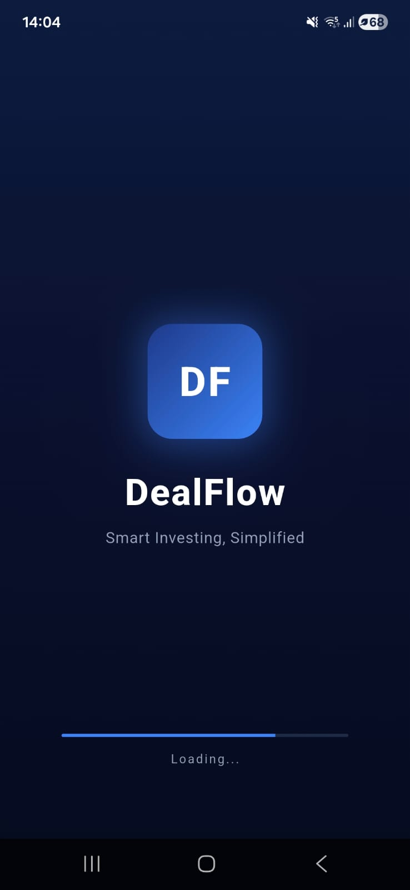
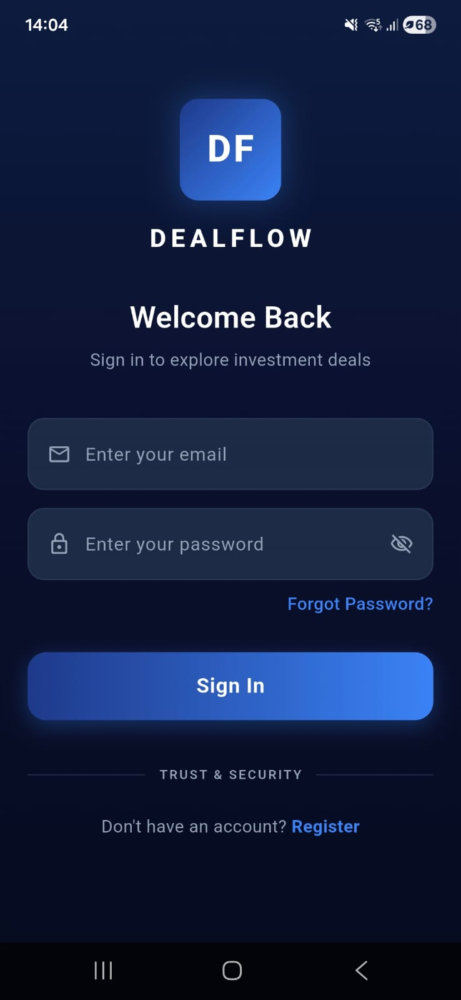
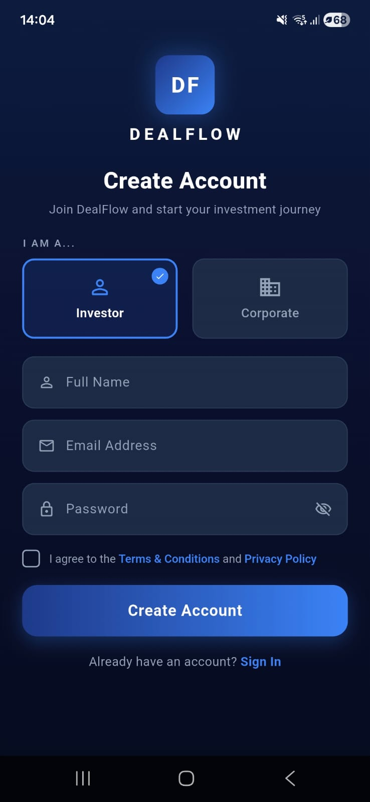

# DealFlow — Smart Investing, Simplified

> A Flutter-based investor deal management app where corporates post investment opportunities and investors browse, filter, and express interest. Built with Clean Architecture, BLoC state management, and a fully local SQLite backend.

---

## 📱 Screenshots

### Splash, Sign In & Sign Up
<table>
  <tr>
    <td align="center"><b>Splash Screen</b></td>
    <td align="center"><b>Sign In</b></td>
    <td align="center"><b>Sign Up</b></td>
  </tr>
  <tr>
    <td></td>
    <td></td>
    <td></td>
  </tr>
</table>

### Investor — Deal Listing, Search & Filters
<table>
  <tr>
    <td align="center"><b>Deal Listing</b></td>
    <td align="center"><b>Search</b></td>
    <td align="center"><b>Filter Sheet (Default)</b></td>
    <td align="center"><b>Filter Sheet (Applied)</b></td>
  </tr>
  <tr>
    <td></td>
    <td></td>
    <td></td>
    <td></td>
  </tr>
</table>

### Investor — Deal Detail, My Interests & Profile
<table>
  <tr>
    <td align="center"><b>Deal Detail (Top)</b></td>
    <td align="center"><b>Deal Detail (ROI + Risk)</b></td>
    <td align="center"><b>My Interests</b></td>
    <td align="center"><b>Investor Profile</b></td>
  </tr>
  <tr>
    <td></td>
    <td></td>
    <td></td>
    <td></td>
  </tr>
</table>

### Corporate — Dashboard, My Deals & Profile
<table>
  <tr>
    <td align="center"><b>Corporate Dashboard</b></td>
    <td align="center"><b>My Deals</b></td>
    <td align="center"><b>Corporate Profile</b></td>
  </tr>
  <tr>
    <td></td>
    <td></td>
    <td></td>
  </tr>
</table>

---

## 🎯 Project Overview

DealFlow is a mini investor deal management platform with two distinct user roles:

- **Corporate** — Post investment opportunities, manage deal status (Open/Close), and track investor interest from a dashboard.
- **Investor** — Browse all available deals, search and filter them, view detailed financial highlights with an ROI projection chart, and express or remove interest.

All data is persisted **100% locally** using SQLite — no internet connection or backend server is required.

---

## 🚀 Features

### 🔐 Authentication
- Role-based sign up — choose **Investor** or **Corporate** at registration
- Email + password sign in with credential validation
- Session persistence via `SharedPreferences` — stay logged in across app restarts
- Auto-routing on launch: Splash → correct home screen based on saved session

### 📋 Deal Listing (Investor)
- Displays all deals as scrollable cards showing: Company Name, Industry Tag, Investment Required (INR), Expected ROI (%), Risk Level, and Status (Open/Closed)
- Colour-coded risk badges: 🟢 Low / 🟡 Medium / 🔴 High
- Industry chips with distinct colour per sector
- Simulated API delay (600ms) on data load for realistic UX

### 🔍 Search & Filter
- Live search by company name or deal title — results update on every keystroke
- Filter bottom sheet with:
  - Industry dropdown
  - Risk level selector (All / Low / Medium / High)
  - Status selector (All / Open / Closed)
  - ROI range slider (0–100%)
- Active filter badge count shown on the filter button
- One-tap "Clear All" to reset filters
- All filtering runs **in-memory** inside `DealBloc` with no additional DB queries

### 📄 Deal Detail Screen
- Company header card with industry colour theming and live Open/Closed status
- Financial highlights grid: Investment Required, Expected ROI, Risk Level, Deal Status
- Deal description paragraph
- **ROI Projection line chart** powered by `fl_chart` — animated curve from JAN to DEC
- **Risk Analysis card** with colour-coded left border (green/amber/red) matching risk level
- Visual assets section
- Sticky bottom CTA button:
  - **"I'm Interested"** → purple gradient → saves interest to SQLite
  - **"Interest Expressed ✓"** → green gradient → one more tap removes interest
  - **Locked state** for Closed deals with explanatory message

### 🔖 My Interests (Investor)
- Summary card showing total deals saved and aggregated total potential investment (auto-formatted to L / Cr)
- Each interest card mirrors the deal card with a delete button
- Confirm-before-remove dialog
- Pull-to-refresh support

### 🏢 Corporate Dashboard
- Stats row: Total Deals / Open / Closed (live from BLoC state)
- Investor interest counter card with mini bar chart visualisation
- "POST NEW DEAL" CTA button
- Recent deals preview list
- Market Insights banner with custom `CustomPainter` wave background

### 📁 Post New Deal (Corporate)
- Full form: Title, Company Name, Industry (dropdown), Investment Required, Expected ROI, Risk Level selector, Description
- `TextFormField` validators on all inputs
- On success: deal is instantly prepended to the list in BLoC state — no reload needed

### 🗂️ My Deals (Corporate)
- Portfolio banner with Total / Open / Closed counts
- Filter pills (All / Open / Closed)
- Per-deal actions: **Close Deal**, **Reopen**, **Delete** — all with confirmation dialogs
- Funding progress bar (visual indicator per deal)

### 👤 Profile (Both Roles)
- Avatar with initials, name, email, role chip
- Info card (Name / Email / Role)
- Logout button — clears session and navigates back to Sign In

---

## 🏗️ Architecture

The project follows **Clean Architecture** with a strict 3-layer separation:

```
lib/
├── core/                          # App-wide constants and failure types
│   ├── db_constants.dart          # All SQLite table/column name constants
│   └── failures.dart              # Typed failure classes (DatabaseFailure, AuthFailure, SessionFailure)
│
├── data/                          # Data layer
│   ├── datasources/
│   │   ├── database_helper.dart           # Singleton SQLite setup (sqflite) — creates users, deals, interests tables
│   │   ├── auth_local_datasource.dart     # Sign up / sign in against SQLite
│   │   ├── deal_local_datasource.dart     # CRUD for deals with simulated delay
│   │   ├── interest_local_datasource.dart # CRUD for investor interests
│   │   └── shared_preferences.dart        # Session persistence (save / get / clear)
│   ├── dummy_data/
│   │   └── dummy_deals.dart       # 3 hardcoded seed deals (always visible, negative IDs)
│   ├── models/
│   │   ├── deal_model.dart        # DealModel with toMap() / fromMap() for SQLite
│   │   ├── interest_model.dart    # InterestModel with toMap() / fromMap()
│   │   └── user_model.dart        # UserModel with toMap() / fromMap()
│   └── repository/
│       ├── auth_repository_impl.dart      # Implements AuthRepository, maps Model ↔ Entity
│       ├── deal_repository_impl.dart      # Implements DealRepository
│       └── interest_repository_impl.dart  # Implements InterestRepository
│
├── domain/                        # Business logic layer — no Flutter/sqflite imports
│   ├── entities/
│   │   ├── deal_entity.dart       # Pure Dart deal entity
│   │   ├── interest_entity.dart   # Pure Dart interest entity
│   │   └── user_entity.dart       # Pure Dart user entity
│   ├── repositories/
│   │   ├── auth_repository.dart   # Abstract AuthRepository interface
│   │   ├── deal_repository.dart   # Abstract DealRepository interface
│   │   └── interest_repository.dart # Abstract InterestRepository interface
│   └── usecases/
│       ├── auth_usecases.dart     # GetSession, SignIn, SignUp, SignOut
│       └── deals_usecases.dart    # GetAllDeals, GetMyDeals, PostDeal, UpdateStatus, Delete, CheckInterest, ExpressInterest, RemoveInterest, GetMyInterests
│
├── presentation/                  # UI layer
│   ├── bloc/
│   │   ├── auth/                  # AuthBloc — CheckSession, SignIn, SignUp, SignOut
│   │   ├── deal/                  # DealBloc — load, post, update, delete, search, filter
│   │   └── interest/              # InterestBloc — load, express, remove, check
│   ├── screens/
│   │   ├── auth/                  # SignInScreen, SignUpScreen
│   │   ├── corporate/             # CorporateBottomNav, DealDashboard, MyDeals, PostDeal, CorporateProfile
│   │   ├── investor/              # InvestorBottomNav, DealListing, DealDetail, MyInterests, InvestorProfile
│   │   └── splash/                # SplashScreen
│   └── widgets/
│       └── filter_bottom_sheet.dart  # Reusable filter sheet widget
│
├── injection_container.dart       # GetIt dependency injection — wires all layers
└── main.dart                      # App entry point
```

---

## 🧠 Architecture & Key Decisions

### 1. Clean Architecture — Why?
The project strictly separates **Domain**, **Data**, and **Presentation** layers. The domain layer has zero Flutter or SQLite imports — it only contains pure Dart entities, repository interfaces, and use cases. This means business rules are completely decoupled from the database or UI framework, making them independently testable and easy to swap implementations.

### 2. BLoC for State Management
Three BLoCs manage all meaningful state:

| BLoC | Responsibility |
|---|---|
| `AuthBloc` | Session check on launch, sign in, sign up, sign out |
| `DealBloc` | Load deals, post, update status, delete, in-memory search & filter |
| `InterestBloc` | Load interests, express, remove, check per-deal interest status |

BLoC was chosen over `setState` or `Provider` because it enforces a clean event → state flow, makes loading/error/success states explicit, and keeps all business logic out of widget trees.

### 3. In-Memory Filtering in DealBloc
Rather than running a new SQLite query every time the user types or changes a filter, `DealBloc` holds the full deal list in memory (`_allDeals`) and applies a `_applyFilters()` method that re-computes the filtered list on every `SearchDealsEvent` or `FilterDealsEvent`. This approach gives instant UI updates with no async delay for filter changes.

### 4. SQLite as the Sole Persistence Layer
All data — users, deals, interests — lives in a single local `dealflow.db` SQLite database managed by a `DatabaseHelper` singleton. There is no remote backend. A `UNIQUE` constraint on `(deal_id, investor_email)` in the interests table prevents duplicate interest entries at the database level.

### 5. Dummy Seed Data Strategy
Three realistic dummy deals (with negative IDs like `-1`, `-2`, `-3`) are always merged into the deal list fetched from SQLite. The negative IDs guarantee they never clash with auto-incremented real deal IDs. This ensures the investor listing screen always has content to browse even on a fresh install.

### 6. Dependency Injection with GetIt
`injection_container.dart` wires the entire dependency graph in order: Core → Datasources → Repositories → Use Cases → BLoCs. Repositories and datasources are registered as **singletons** (shared state), while BLoCs and use cases are **factories** (new instance per use). This gives the app predictable lifecycle management without a manual service locator.

### 7. Role-Based Navigation
On sign in, the app reads `user.role` from the returned `UserEntity` and routes to either `InvestorBottomNav` or `CorporateBottomNav`. Each bottom nav provides its own `BlocProvider` scope, ensuring BLoC instances are scoped to their role and disposed correctly on logout.

### 8. Session Persistence
`SharedPreferences` stores `email`, `role`, and `name` after a successful sign in or sign up. On every cold start, `SplashScreen` dispatches `CheckSessionEvent` to `AuthBloc`, which calls `GetSessionUsecase`. If a valid session exists, the user is routed directly to their home screen — skipping the sign in flow entirely.

### 9. Simulated API Delay
`DealLocalDatasourceImpl.getAllDeals()` includes a 600ms `Future.delayed` and `getDealsByPostedByEmail()` a 300ms delay. This was a deliberate decision to simulate a real network call and test that loading states (`DealLoading`) render correctly in the UI.

---

## 🛠️ Tech Stack

| Category | Technology |
|---|---|
| Framework | Flutter (Dart) |
| State Management | flutter_bloc + equatable |
| Local Database | sqflite (SQLite) |
| Session Storage | shared_preferences |
| Charts | fl_chart |
| Dependency Injection | get_it |
| Architecture | Clean Architecture (Domain / Data / Presentation) |
| IDE | VS Code |
| Version Control | GitLab |

---

## 📦 Key Dependencies

```yaml
dependencies:
  flutter_bloc: # BLoC state management
  equatable:    # Value equality for BLoC states/events
  sqflite:      # SQLite local database
  path:         # Database path helper
  shared_preferences: # Session persistence
  fl_chart:     # ROI Projection line chart
  get_it:       # Dependency injection service locator
```

---

## ⚙️ Getting Started

### Prerequisites
- Flutter SDK `>=3.0.0`
- Dart SDK `>=3.0.0`
- Android Studio / VS Code with Flutter plugin

### Installation

```bash
# 1. Clone the repository
git clone https://github.com/YOUR_USERNAME/investor_deal_management.git
cd investor_deal_management

# 2. Install dependencies
flutter pub get

# 3. Run the app
flutter run
```

> No API keys, Firebase setup, or internet connection required. The app runs entirely offline.

---

## 🧪 Test Credentials

You can register directly in the app, or use these accounts if pre-seeded:

| Role | Email | Password |
|---|---|---|
| Investor | prajwal@gmail.com | any password you set at sign up |
| Corporate | nexus@gmail.com | any password you set at sign up |

> Accounts are stored locally in SQLite — register once and the session persists.

---

## 📁 Data Flow Example — Express Interest

```
User taps "I'm Interested"
        ↓
InterestBloc receives ExpressInterestEvent(InterestEntity)
        ↓
ExpressInterestUsecase.call(interest)
        ↓
InterestRepositoryImpl.expressInterest(interest)
        ↓
InterestLocalDatasourceImpl.expressInterest(InterestModel)
        ↓
DatabaseHelper.insertInterest(model) → SQLite INSERT
        ↓
InterestBloc emits InterestOperationSuccess
        ↓
UI updates button to "Interest Expressed ✓" (green)
```

---

## 📊 Database Schema

### `users`
| Column | Type | Notes |
|---|---|---|
| id | INTEGER PK | Auto-increment |
| name | TEXT | |
| email | TEXT UNIQUE | |
| password | TEXT | |
| role | TEXT | `investor` or `corporate` |

### `deals`
| Column | Type | Notes |
|---|---|---|
| id | INTEGER PK | Auto-increment |
| title | TEXT | |
| company_name | TEXT | |
| industry | TEXT | |
| investment_required | TEXT | Formatted string e.g. `₹2,50,00,000` |
| expected_roi | REAL | |
| risk_level | TEXT | `Low` / `Medium` / `High` |
| status | TEXT | `Open` / `Closed` |
| posted_by_email | TEXT | |
| posted_by_name | TEXT | |
| description | TEXT | |
| created_at | TEXT | ISO 8601 string |

### `interests`
| Column | Type | Notes |
|---|---|---|
| id | INTEGER PK | Auto-increment |
| deal_id | INTEGER | References deal |
| investor_email | TEXT | |
| + all deal fields | | Denormalised for offline read performance |
| UNIQUE | (deal_id, investor_email) | Prevents duplicates at DB level |

---

## 🗺️ App Navigation Map

```
SplashScreen
    ├── AuthAuthenticated (investor)  → InvestorBottomNav
    │       ├── [0] DealListingScreen
    │       │       └── → DealDetailScreen
    │       ├── [1] MyInterestsScreen
    │       │       └── → DealDetailScreen
    │       └── [2] InvestorProfileScreen
    │
    ├── AuthAuthenticated (corporate) → CorporateBottomNav
    │       ├── [0] DealDashboardScreen
    │       │       └── → PostNewDealScreen
    │       ├── [1] MyDealsScreen
    │       └── [2] CorporateProfileScreen
    │
    └── AuthUnauthenticated → SignInScreen
                                └── → SignUpScreen
```
